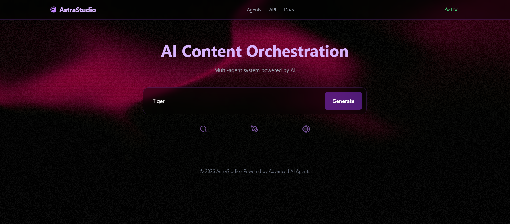
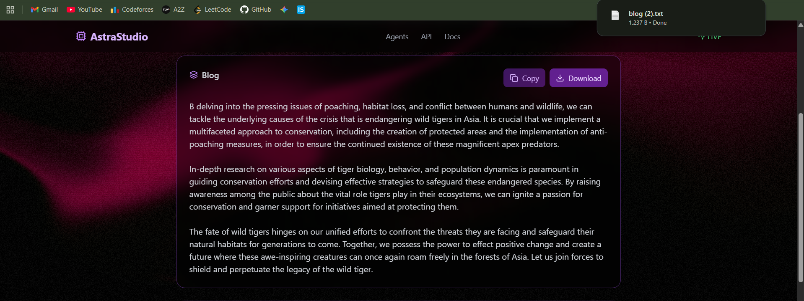
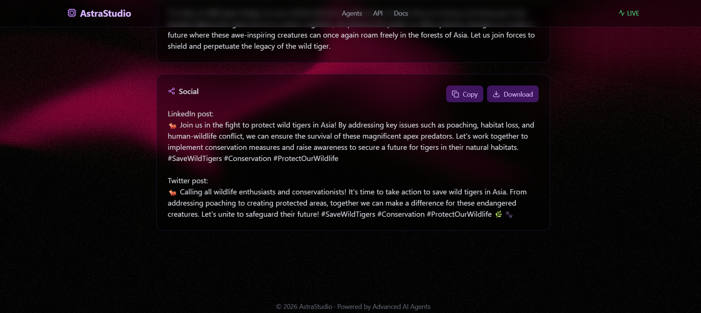

# 🚀 AI Agent Content Automation Platform

## 🌟 Overview
This project is a **multi-agent AI-powered content automation system** that streamlines the entire content lifecycle — from research to blog generation, SEO optimization, and social media content creation.

Built with a **modern Next.js frontend + AI backend integration**, this platform demonstrates real-world applications of **AI agents and workflow orchestration**.

---
## 📸 Screenshots

### 🏠 UI


### ✍️ Blog Generation


### 📱 Social Content


## 🧠 Key Features

- 🤖 **Multi-Agent Architecture**
  - Research Agent
  - Content Writer Agent
  - SEO Optimization Agent
  - Reviewer Agent (Recursive Improvement)
  - Social Media Agent

- ⚡ **Real-Time AI Generation**
  - Dynamic blog creation using LLM APIs (OpenRouter)

- 🎨 **Premium UI/UX**
  - Glassmorphism design
  - Gradient-based modern theme (Purple–Pink–Gold)
  - Fully responsive (mobile + desktop)

- ✨ **Advanced Features**
  - Typing animation (ChatGPT-style)
  - Copy to clipboard
  - Download generated blog
  - Smooth transitions & hover effects

---

## 🏗️ Tech Stack

### Frontend
- Next.js (App Router)
- Tailwind CSS
- React Hooks

### Backend
- Next.js API Routes
- LLM Integration via OpenRouter

### AI / Concepts
- Prompt Engineering
- AI Agent Orchestration
- Recursive Content Refinement

---

## 🔄 Workflow Architecture

User Input → Research Agent → Writer Agent → SEO Agent → Reviewer Agent → Social Media Agent → Final Output

---

## 📸 Demo

> Enter a topic → AI agents generate a full blog + social media content in seconds.

---

## ⚙️ Installation & Setup

```bash
# Clone the repository
git clone https://github.com/your-username/ai-agent-platform.git

# Navigate to project
cd ai-agent-platform

# Install dependencies
npm install


🔐 Environment Variables

Create a .env.local file:

OPENROUTER_API_KEY=your_api_key_here
▶️ Run Locally
npm run dev

Open:

http://localhost:3000
🌐 Deployment

Deployed using Vercel

npx vercel

Add environment variable in Vercel dashboard:

OPENROUTER_API_KEY
🎯 Use Case

This platform can be used for:

Automated blog generation
SEO content pipelines
Marketing automation
AI-driven content workflows
💡 Future Enhancements
🌙 Dark Mode
💬 Chat-style AI interface
📊 Analytics dashboard
🧩 MCP (Model Context Protocol) integration
🧠 Memory-based AI agents
👨‍💻 Author

Nakul Sonkusare
3rd Year B.Tech (EXTC)
Sardar Patel Institute of Technology

⭐ Acknowledgements
OpenRouter (LLM API Gateway)
Next.js
Tailwind CSS